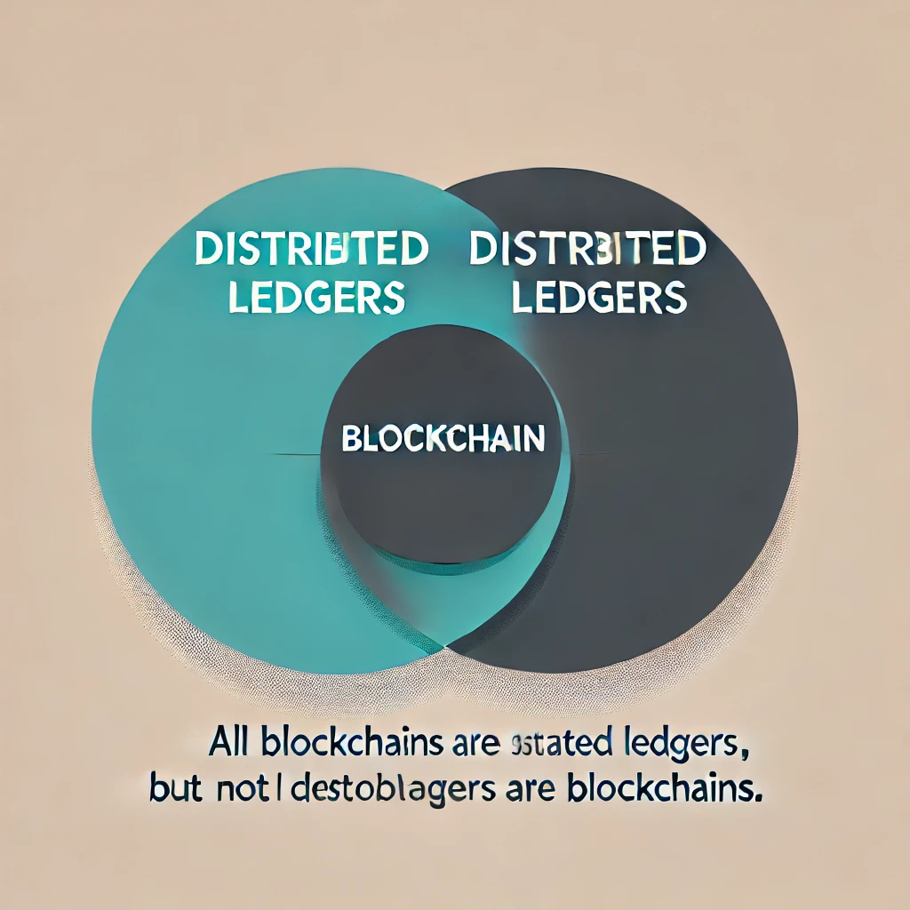

# Rust-Chain

Welcome to the development of a decentralized **blockchain system**, built entirely from scratch using **Rust**. This project aims to create a secure and efficient ledger where blocks of data are linked together using **cryptographic hashing**, ensuring the chain's integrity and immutability over time.

By integrating a reliable **consensus algorithm**, we will establish a mechanism for achieving agreement among all participants in the network, maintaining trust and decentralization. With Rust’s focus on **performance** and **memory safety**, the project is designed to offer a fast, secure, and scalable foundation for decentralized applications.

The goal is to develop an elegant and robust system that captures the essential principles of blockchain technology while leveraging the power of Rust for building a reliable and future-proof infrastructure.

### What is a Blockchain?

To understand blockchains, we first need to discuss distributed ledgers. You've likely heard this term mentioned alongside blockchain, as the two are closely related.

You might have encountered the peer-to-peer file-sharing protocol, **BitTorrent**. This protocol allows file-sharing in a decentralized way. Typically, when downloading a file from the internet, you send a request to a specific server that stores the entire file and transfers it to your device. This is known as **client-server architecture**.

BitTorrent, however, distributes a single file across multiple peers simultaneously. When downloading a file from the **Torrent network**, you're actually pulling pieces from multiple sources. Over time, you become a source yourself by participating in the network, sharing the file with others.

**Distributed ledgers** have several key characteristics. The data (i.e., the ledger) often not just a simple file but more like a database, or even anything you choose it to be—is shared across multiple actors or peers. There is no single authority responsible for maintaining, modifying, or distributing the ledger. Instead, all connected peers hold a copy of the same ledger, ensuring decentralization and transparency.
This concept raises numerous challenges and questions, such as: Who is allowed to add information to the network? Who can edit it? Who has permission to read it? How much data can be added? Who covers the cost of storage? Who pays for processing? Which data is prioritized? How do you detect failures? How do you handle malicious participants?
How is authentication managed? What about network latency? These are complex technical issues, and addressing them requires some form of **consensus** among all participating peers. Consensus itself is a broad topic with various algorithms tailored to different use cases, each with its own set of advantages and drawbacks.

Here, we will implement a variant of **Proof of Work**, a mechanism used in well-known public blockchains like **Ethereum** (which may switch to Proof of Stake in future versions) and **Bitcoin**. We will revisit this topic of the write-up.
If we want to visualize the relationship in a Venn diagram, it might look like this:

//distributed ledger\*

A blockchain is simply a **special type of ledger**. It differs from regular ledgers in that it remembers all the state transitions it has ever undergone.

Think of it like a typical database, where every change or transaction is recorded. This allows the final state of the database to be obtained by executing all the recorded transactions in sequence. In blockchain terminology, this final state is referred to as the **World State**.
